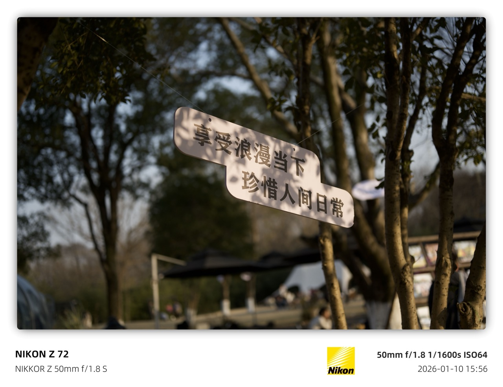
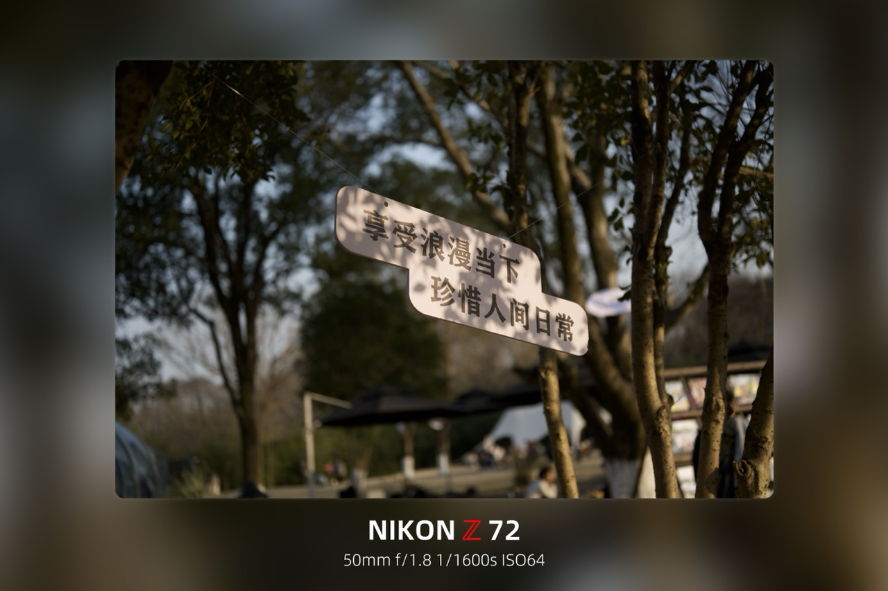
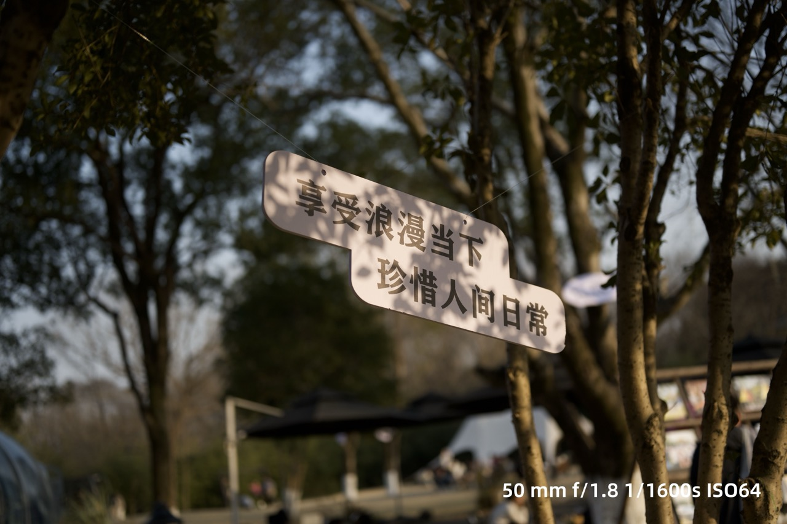

# semi-utils / Watermark

> A photo watermarking utility for batch watermark generation, EXIF rendering, image layout processing, and export quality control.
>
> 一个用于批量添加照片水印、渲染 EXIF 信息、处理图片版式以及控制导出质量的工具。

## Features / 功能

- Batch-generate photo watermarks from reusable JSON templates.
- Render camera model, lens, focal length, aperture, shutter speed, ISO, shooting time, and brand logos from EXIF data.
- Preserve source ICC color profiles during preview conversion and final export, keeping Display P3, sRGB, and other color spaces mapped consistently.
- Parse GPS coordinates from EXIF metadata and reverse-geocode them into readable state, city, or locality text for location-aware watermarks.
- Support multiple layout styles, including classic EXIF watermarks, centered logo watermarks, blurred backgrounds, rounded corners, shadows, and social-media-friendly margins.
- Keep template files editable so custom text, logos, and styles can be adjusted without changing code.
- Provide a Flask-based local web interface for previewing and processing images.
- Choose runtime watermark images from the root `watermark/` folder, drag them anywhere on the preview image, and export the positioned result.

- 支持通过可复用的 JSON 模板批量生成照片水印。
- 可从 EXIF 信息中渲染相机型号、镜头、焦距、光圈、快门、ISO、拍摄时间和品牌 Logo。
- 在预览转换和最终导出时保留源图 ICC 色彩配置，避免 Display P3、sRGB 等色彩空间映射不一致造成偏色。
- 可从 EXIF GPS 信息中解析经纬度，并反向解析为州、城市或街区等可读地点，用于带地点信息的时间水印。
- 支持多种版式：经典 EXIF 水印、居中 Logo 水印、背景模糊、圆角、阴影和适合社交媒体分享的留白样式。
- 模板文件可直接编辑，方便在不改代码的情况下调整文字、Logo 和视觉样式。
- 提供基于 Flask 的本地网页界面，用于预览和处理图片。
- 支持从项目根目录 `watermark/` 文件夹选择运行时水印，在预览图上拖拽到任意位置，并导出带水印图片。

## Installation / 安装

Requires Python 3.13 or newer.

需要 Python 3.13 或更高版本。

```bash
pip install -r requirements.txt
```

## Usage / 使用

Start the local web app:

启动本地网页应用：

```bash
python app.py
```

Then open the local address printed in the terminal and process images through the web interface.

随后打开终端中显示的本地地址，即可在网页界面中处理图片。

Location reverse-geocoding can be configured in `config/config.ini`. Results are cached locally in `config/geocoding_cache.json` to reduce repeated network lookups.

反向解析位置信息可在 `config/config.ini` 中配置，解析结果会缓存在 `config/geocoding_cache.json`，减少重复网络查询。

### Runtime watermark / 运行时水印

Put watermark images in the repository root `watermark/` folder. PNG, JPG, JPEG, and WebP files are supported. After starting the web app, select a preview image, enable the "运行时水印" checkbox, choose a watermark, adjust its size and opacity, drag it to the desired position, and click the main "开始执行" button. If the checkbox is not enabled, runtime watermark preview and export are both disabled. The exported image is written to the configured output folder while preserving the source ICC color profile when available.

将水印图片放入项目根目录的 `watermark/` 文件夹，支持 PNG、JPG、JPEG 和 WebP。启动网页后，先选择需要预览的图片，勾选“运行时水印”，选择水印并调整大小、透明度和位置，然后点击主流程的“开始执行”。如果未勾选该选项，预览和导出都不会添加运行时水印。导出的图片会写入配置的输出目录，并在可用时保留源图 ICC 色彩配置。

## Templates / 模板

| Template / 模板 | Description / 描述 | Preview / 效果 |
| --- | --- | --- |
| [standard1](./static/standard1.json) | Classic EXIF watermark with camera model, lens, focal length, aperture, shutter speed, ISO, shooting time, and camera brand logo.<br>经典 EXIF 水印，包含相机型号、镜头、焦距、光圈、快门、ISO、拍摄时间和相机品牌 Logo。 |  |
| [standard2](./static/standard2.json) | Adds rounded corners, shadows, and margins on top of `standard1`, suitable for social media sharing.<br>在 `standard1` 基础上添加圆角、阴影和留白，适合社交媒体分享。 |  |
| [nikon_blur](./static/nikon_blur.json) | Nikon-style watermark with a highlighted red `Z` in the camera model and a blurred background.<br>尼康风格水印，相机型号中的红色 `Z` 高亮，并配合背景模糊效果。 |  |
| [blur](./static/blur.json) | Minimal centered layout with camera model and shooting parameters over a blurred background.<br>简洁居中版式，相机型号和参数垂直居中展示，并配合背景模糊效果。 |  |
| [normal1](./static/normal1.json) | Minimal lower-right shooting-parameter watermark.<br>极简风格，在右下角显示拍摄参数，低调不抢眼。 |  |
| [normal2](./static/normal2.json) | Folder name plus shooting time with simple orange text.<br>文件夹名称加拍摄时间，橙色文字，简洁实用。 |  |
| [center_logo](./static/center_logo.json) | Center logo watermark with customizable text around it.<br>中心 Logo 水印，可自定义四周文字内容。 |  |

## Release notes / 更新日志

### v2.1.7 - 2026-06-28

- Enlarged the image preview area and moved runtime controls into the lower workflow row.
- Made runtime watermark export strictly opt-in: unchecked means no preview overlay and no exported runtime watermark.
- Removed the separate runtime "export watermarked image" action; runtime watermarks now follow the main batch process.
- Improved portrait EXIF watermark sizing to better match mobile-style bottom metadata bars.
- Added width-aware text truncation with `...` to avoid overlapping long address/location strings.
- Preserved output behavior for files outside the configured input folder by exporting them safely by filename.
- Windows package SHA256: `E32C0857CC657D7DAED4F288B16805D71C909753E736D42F938BB30A38EE1CE8`.

## Build / 打包

Build scripts and CI workflows are included under `.github/workflows`.

打包脚本和 CI 工作流位于 `.github/workflows` 目录。

## License / 许可证

This project is released under the [PolyForm Noncommercial License 1.0.0](LICENSE).

本项目基于 [PolyForm Noncommercial License 1.0.0](LICENSE) 发布。

Commercial use is prohibited unless you obtain prior written permission from the copyright holder.

未经版权方事先书面许可，禁止将本项目用于商业用途。

Permitted uses include personal study, research, testing, hobby projects, education, and other noncommercial purposes allowed by the license.

许可证允许个人学习、研究、测试、兴趣项目、教育以及其他非商业用途。

### Third-party license / 第三方协议

This project may work with [ExifTool](https://exiftool.org/). ExifTool is distributed under its own [GPL v1 + Artistic License 2.0](https://exiftool.org/#license), and its license terms are not changed by this repository's license.

本项目可能配合 [ExifTool](https://exiftool.org/) 使用。ExifTool 基于其自身的 [GPL v1 + Artistic License 2.0](https://exiftool.org/#license) 发布，本仓库的许可证不会改变 ExifTool 的原始授权条款。

## Attribution / 致谢

This repository is based on the original [`leslievan/semi-utils`](https://github.com/leslievan/semi-utils) project and keeps the original project attribution and license terms. This fork extends it with local workflow fixes plus the runtime draggable watermark feature.

本仓库基于原项目 [`leslievan/semi-utils`](https://github.com/leslievan/semi-utils)，并保留原项目作者署名和许可证条款；本分支在此基础上扩展了本地工作流修复以及运行时可拖拽水印功能。
